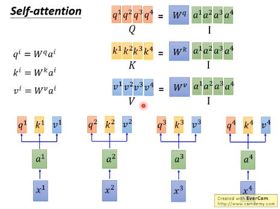

# Attention is all you need.

- ### 诞生背景

  LSTM = RNN + 长期记忆

  Bi-LSTM = 2 x LSTM  长短期记忆双向传递

  Attention = 不同于的 Bi-LSTM 全新结构，可以并行计算，意味着更快

- ### 计算原理

  

  1. #### x的Embedding ---- a

     所有x到所有a是一个同一个矩阵W运算出来的结果，x , a都是vec

     事实上实际运算中，a还要加上一个人为设定的e vec 才是真正的a Emdeding，注意是加法不是拼接，为的是传递x1,...xn之间的位置信息

  2. #### a ---> q , k , v

     a与三个不同的矩阵进行相乘得到三个不同vec ：q k v

     

     

  3. #### 计算a（attention）， 注意与上一步中的a（embedding）不一样

     1. *a    = （query向量 点乘 key向量）/  根号（q的维度）*  得到的是一个标量scaler
     2. *a hat   =   softmax(a1, ... an)* 

     

     

     

  4. #### 最后计算出第一个输出b1

     b1   =  所有 （ a hat  点乘  自家v  ）的和

     

     

- ### 为什么说attention结构比LSTM要好呢？

  ##### 根本原因：像CNN卷积运算一样并行计算却又不像CNN那样损失局部原始参数

  它已经把每个input输入拆分成了3个vec，计算a hat 也就是attention的时候是可以用矩阵并行计算的，不需要像lstm那样计算完一个memory和output才可以计算下一个memory和output，这点上面借鉴了CNN"卷积核"（Wq, Wk, Wv）并行计算的思想，但是它又不像CNN的pooling那样会丢失大量原始参数，事实上它一个参数都没有丢，只是换一种方式把他们揉在了一块

  计算attention时候可以用矩阵实现并行计算

  

  计算输出b的时候也可以用矩阵实现并行计算

  

  总的来回顾一下，就是一连串的矩阵运算，它们只有3次矩阵乘法，不像lstm乘法计算次数随着input sequence的加长会显著提高，用上GPU进行加速，多个小矩阵乘多次的lstm当然不如几个大矩阵乘3次快了

  

  

- ### 什么是Transformer

  ##### 《Attention is all you need》论文一提出就引起轰动，于是掀起了一波用Transformer结构来取代LSTM的热潮，同样的，seq2seq model也被改装了一下，encoder和decoder都用上了Attention结构，然后重新起了个名字，Transformer就这样诞生了

  反正很难看懂，记住Attention对比LSTM的优点就好了，两个字：更快

  

  