# ELMO & BERT 

本文主要讲的是language model也就是语言表示方法的更新历史，结合了当前最热的BERT进行分析了，为什么说bert的诞生是NLP界开天辟地级别的事件

- ## 早期模型: one of N Encoding  &  Word Class  &  Word Embedding

  1. #### one of N Encoding：

     最早的文字表示方式，每个词汇代表了一个one hot向量，缺点是无法表示词汇之间的关联，而且词汇量大了以后，向量维度会变得很大而稀松，浪费计算性能

  2. #### Word Class：

     把词汇进行分类，并分别编码，这样可以解决词汇之间的联系表示，但是向量维度还是太大了

  3. #### Word Embedding：

     解决了词汇之间关联性的表示问题，同时也可以把词向量的维度压缩到很小的范围，embedding的转化矩阵是需要上下文训练出来的

     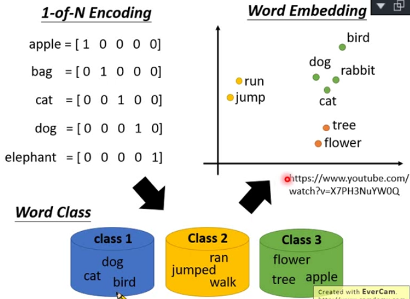

  

- ### 问题： Same word type with different word tokens

  很多词汇都会根据使用上下文的不一样而有不一样的语义，比如bank有银行意思，也有河畔的意思，也有存储库的意思

  但是Word Embedding方法对每个word type都只有一种表示方法，无法结合语境区分词汇含义，让它们在不同场景下有的不同word tokens

  

- ### 想法： Contextualized Word Embedding

  1. 每个word token 都应该有它专属的 embedding

  2. 这个word embedding of word token应该由它使用的具体语境的上下文context决定

     

- ## ELMO

  **E**mbeddings from **L**anguage **Mo**del 

  **考虑上下文进行词嵌入的语言模型**

  是一个LSTM-based language model，与word-embedding一样是一种语言表示模型，不需要经过经过标注的语料，只要普通的语料就可以预训练出来，特点如下

  1. ####  based on Bidirection-LSTM

     正向得到的蓝色的embedding vec 和逆向得到的橙色embedding vec 分别拼接起来就可以分别表示各个词的token了

     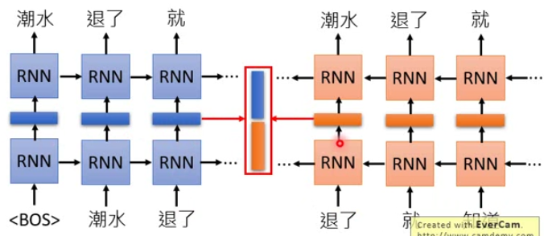

  2. #### multi layers

     实际的ELMO不止有两层LSTM这么简单，他是多层的，而且每层的embedding vec 都会被用到，但是每层的embedding vec 会根据下游NLP任务的不同而有不一样的 α 值（权重）

     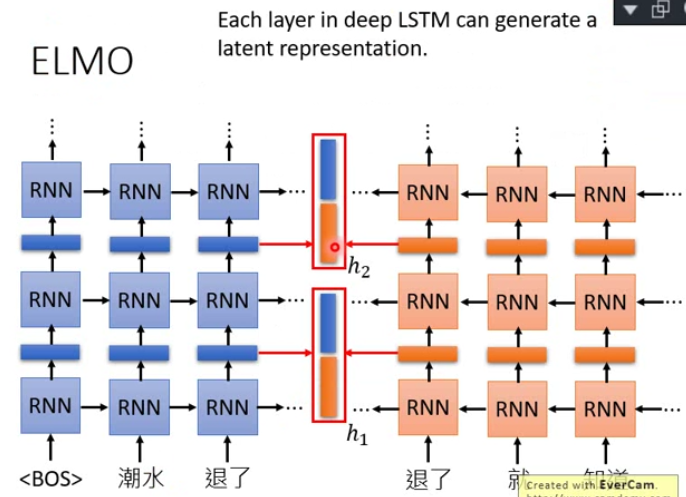

  3. #### final representation depend on different task

     最后每个word得到的embedding vec是所有层的embedding vec通过不同的权重α加起来得到的，而些α值也是经过训练得到的，注意这个训练过程是ELMO+Task同时进行训练，下图中的h1,h2代表的是不同layers得到的embeddings

     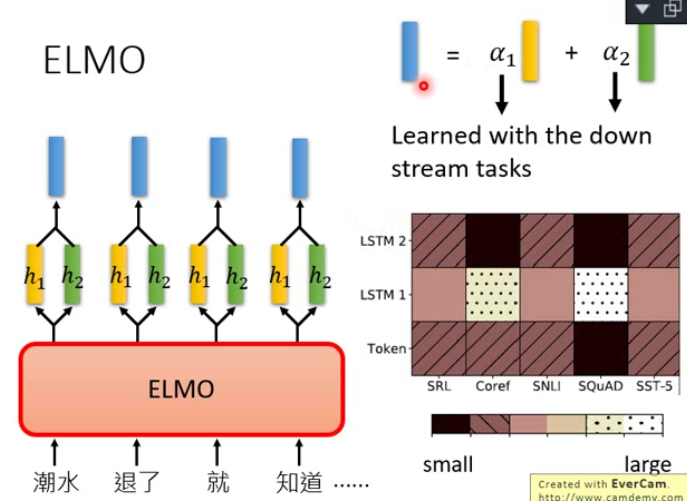

     

- ## BERT

  **B**idirectional **E**ncoder **R**epresentations from **T**ransfromers

  **拆自Transform的双向编码语言表示方法**

  1. #### 模型的创新点

     1. ##### from Transformer

        前面的笔记《Attention is all you need》有提到过说所有的RNN/LSTM都可以用self-attention结构进行替换得到新的模型，例如Seq2Seq中的LSTM被替换成self-attention就变成了Transformer

     2. ##### encoder with self-attention layers

        后来人们发现这个Transformer中的encoder抽离出来后可以结合很多不同的结构例如Linear transform+softmax 来解决不同的Tasks（分类，生成），而且这个encoder还可以进行预训练（Learned from a large amount of text without annotation）,这个预训练概念很重要，因为以往的trainsformer是要根据不同的生成任务提供不同的label从头开始训练的，这意味着bert比transformer更灵活，也更节省计算资源

     3. ##### fine-tune

        但是encoder终究还是个language model，只是得到了word的表示方法而已。后面要结合不同的网络结构解决不同task，这时候只要进行微调训练（fine-tune）就可以，这种pretrained+fine-tune的方式大大节省了计算资源，并且google research 已经放出了各种语言和各种复杂程度的pretrained bert model

        注意：

        对于中文来说，使用词来训练还是使用字来训练，李老师给出了自己的看法，中文中常用的字character只有4000多个，但是由这些字组成的词却太多了无法枚举，所以用character来作为预训练的输入单位是更为合适的

  2. #### 两种训练方法

     注意这两预训练方法其实是同时进行的

     1. ##### Approach 1:  Masked LM

        预训练的时候有15%的token是挖空的[MASK]，然后把模型转化的embedding接入一个Linear Multi-class Classifier中，而label就是所有的词汇表，真正的word会作为correct label，其他的word就会作为wrong labels，但是实际因为是很多的语料，所以mask的位置得到的embedding与相似语义的word的embedding是类似的

        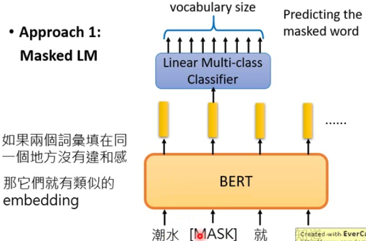

     2. ##### Approach 2:  Next Sentence Prediction

        预训练的时候：

        句子之间的边界会以[SEP]符号来表示，这个[SEP]的embedding

        句子的开头以[CLS]来表示，这个位置的embedding表示以[SEP]分割的两个句子是否是连续的（为什么不是放结尾：因为对于self-attention layers来说头尾都是一样的）

        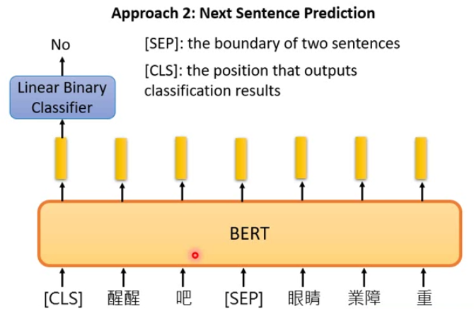

        

  3. #### 使用BERT进行不同的NLP下游任务

     注意Fine-tune和pretrain不一样，前者是需要结合任务使用含有标注的数据进行训练（对decoder来说是从头训练，对encoder来说是微调），而后者是不需要带标注的数据的（但其实也是监督学习，只是它取label的方式是随机的mask和特定的符号转化：上下句间如逗号会被替代成[SEP]，句首如句号会被替代成[CLS]）

     1. ##### 对于简单分类任务：情感分析，文章摘要

        ###### 输入：句子

        ###### 输出：句子的类别

        输入训练语料sentence的句首被[CLS]标记，最后这个word的embedding需要街上一个分类器，而分类器需要有这个句子的真实label数据，例如属于哪个class

        注意：只有这个linear classifier的参数是需要从头开始学的，而bert作为encoder只需要进行微调fine-tune

        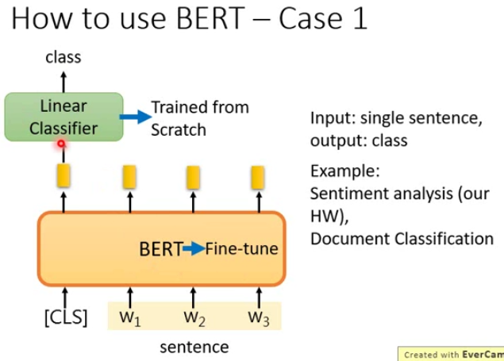

        

     2. ##### 对于复杂的分类任务：实体识别，词性识别

        ###### 输入：句子

        ###### 输出：句子中各个词/字的类别

        输入训练语料sentence的句首被[CLS]标记，其他的word embedding需要各自接上一个个线性分类器最后结合label进行训练，这种任务需要标注的词太多，结构也比较复杂

        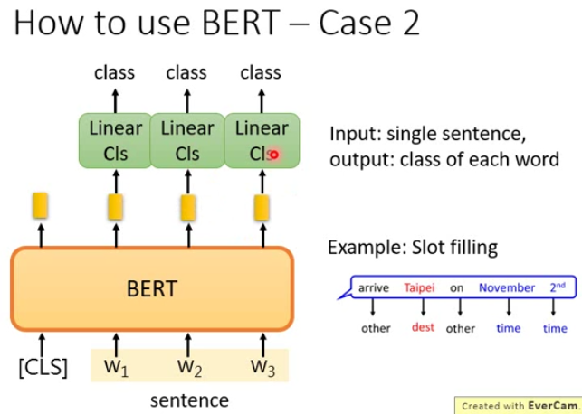

        

     3. ##### 句子关联性分析

        ###### 输入：句子对

        ###### 输出：代表句子之间的关系（T/F/unknow）的类别

        第一个句子的开头用[CLS]进行标记，第一个句子和第二个句子之间用[SEP]标记，而[CLS]的embedding会被接入一个线性分类器结合labels（可以是two classes或muti-class）进行训练

        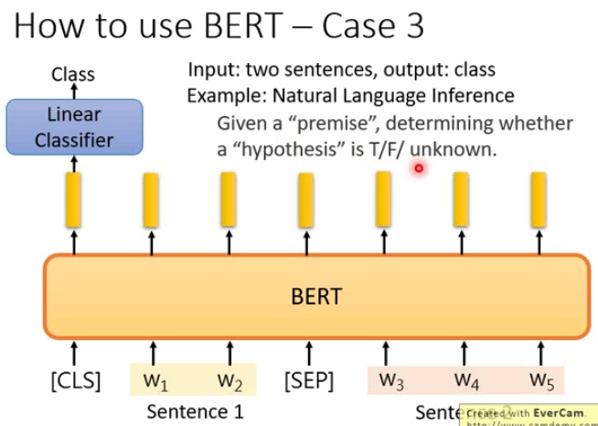

        

     4. ##### 知识问答：SQuAD

        ###### 输入：文本对：文档Document  +  查询问题Query

        ###### 输出：整数对：答案words的开头word在文档中的索引index，答案words的结尾word在文档中的索引index

        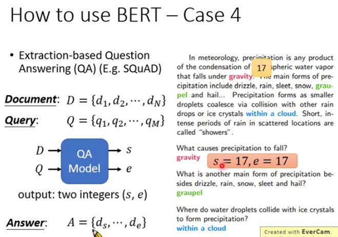

        ###### 训练过程

        1. encode阶段

           文本在输入的时候当成句子对，把第一个句子query/question的开头用[CLS]进行标记，在query/question句子和document文本之间用[SEP]进行标记，这些句子加上标记每个词都会输出word embedding vec

        2. attention阶段

           initialize两个vec : start vec & end vec ，这两个vec必须与encode的embedding vec 具有相同的维度

           首先拿start vec对文档document中的所有embedding vec做attention打分（计算向量的dot product，把得到的所有分数softmax），打分最高的vec对应document中的索引值s就作为第一个整数输出

           然后类似的，拿end vec对文档document中所有的embedding vec进行打分，打分最高的vec对应document中的索引值e就作为第二个二个整数输出，如果e=s说明答案只有一个单词，如果e<s说明没有答案，这在squad2.0中是有可能出现的

           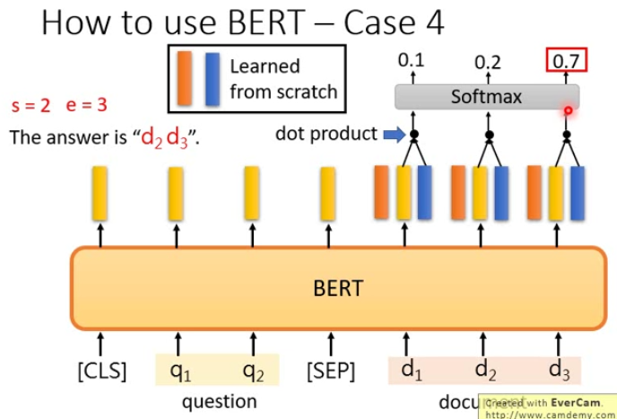

- ## ERNIE

  **E**nhanced **R**epresentation through K**n**owledge **I**nt**e**gration

  **通过知识集成加强的语言表示方法**

  特点：专门为中文而设计的语言表示模型

  encoder部分与bert相似，不同的在于训练方式Masked LM上，bert训练的时候mask的是字，但是这样对于一些固定的词如`黑X江`来说很容易就可以猜到这个字可能是`龙`，所以erine模型Masked LM的时候会把一些词整个mask掉来进行训练

  

- ## GPT-1/GPT-2

  **G**enerative **P**re-**T**raining

  生成式任务预训练模型

  特点：1. 参数巨大  2.实际就是Transformer中抽离出来的decoder

  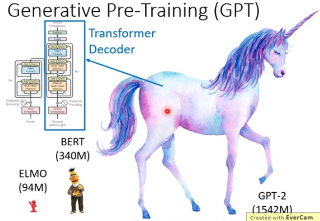

  同样是利用了self-attention layers，每个输入都会进行embedding得到a(embedding vec)然后经过三个矩阵M~q~ , M~k~ , M~v~ 的线性变换得到q, k, v 三个维度相同的vec

  例如要输出b^3^，需要用q^3^对所有的k进行dot-product得到三个分数，把这三个分数进行一次softmax得到a hat(attention score)，这些小于1的a hat作为各个word embedding的代表权重乘以各个word embedding对应的v向量，最后把这些v向量加起来（不是拼起来）得到与v维度相同的b^3^ embedding vect，这个b^3^在多层self-attention layers中又可以作为下一层的输入

  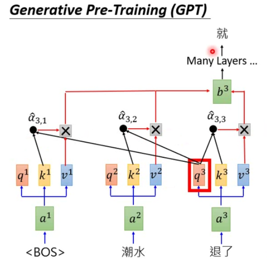