# RNN & LSTM

- ### 递归神经网络RNN

  - 传统的神经网络有一个缺点，假如对点供应中每个时间点发生的时就按进行分类，神经网络做不到利用电影中的先前事件的推理来得到后续事件的分类，循环神经网络做到了这一点

  - 循环神经网络带有循环的网络，允许讯息持续存在

    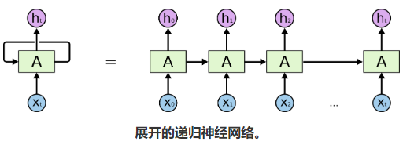

  - 但是RNN中因为每次的hidden state都会经过一个tanh的激活，所以信息丢失的很快，意味着它只有短期的记忆

    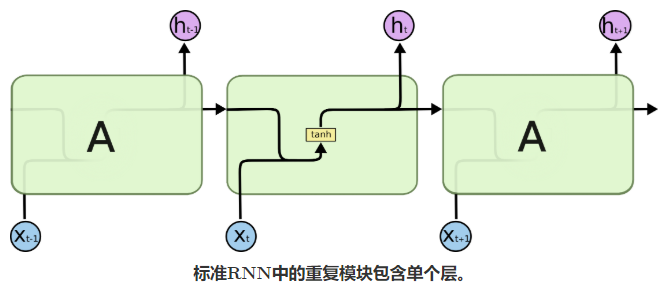
    
  - 详细计算方法

    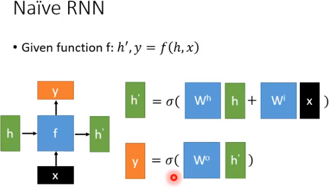

    1. 首先计算hidden：把h和x向量经过一个转换之后加在一起，最后经过tanh激活得到h'
    2. 然后计算y：把h'通过一个转换后再通过tanh激活得到最后的输出y

    

- ### 长短期记忆神经网络 LSTM Networks

  - lstm解决了普通RNN中的两个问题

    - 向前传播的时候因为tanh的压缩导致的长距离记忆丢失
    - 反向传播的时候因为tanh导数的压缩导致的梯度消失从而使得memory传播的权重无法更新

  - lstm的重复模块中包含四个交互层

    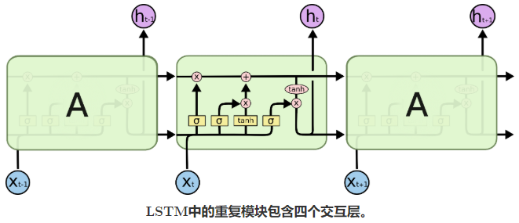

  - 实际上可以把这四个层交互理解成四个计算

    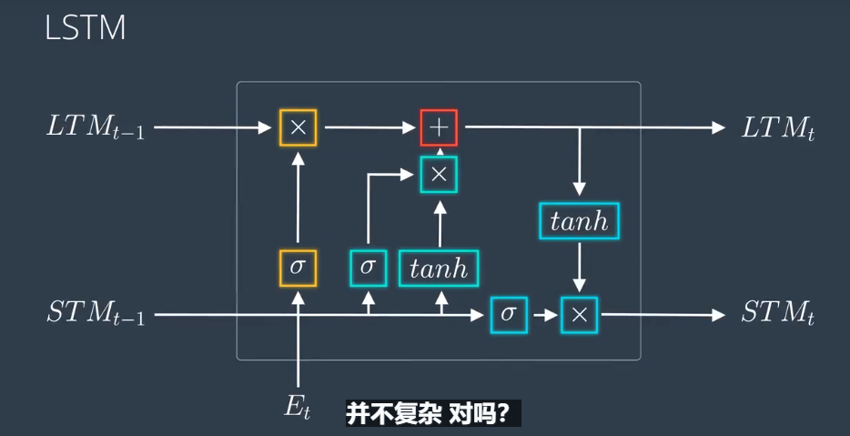

    1. 把所有的`X`都都理解成一个门gate，决定门的开关程度的是一个（0，1）的常数，这个值由相应的sigmoid计算出来

    2. Et+STM~t-1~ 经过sigmoid算出一个forget程度（0，1），乘以LTM~t~ 计算出衰减后的LTM~t-1~ 

    3. Et+STM~t-1~ 经过sigmoid算出一 个input程度（0，1），乘以学到的知识 tanh(Et+STM~t-1~ )得到衰减后的STM~t-1~ 

    4. **LTM~t~ / c^t^ 的诞生：**这个经过forget gate的LTM~t-1~ 还要加上经过learn gate的STM~t-1~ 就成为了下一个时间点的LTM~t~ ，这个LTM~t~  就是相当于rnn中的memory cell，

       这个加法你也可以理解为remember gate，尽管他不是一个数（不需要经过学习），他就是一个运算，因为S/T的衰减都已经提前计算完了

    5. **STM~t~ / h~t~ 的诞生**：Et+STM~t-1~ 经过sigmoid算出一个output程度（0，1）然后乘以LTM~t~  就可以计算出STM~t~ 了，这也是y~t~ 也可以理解为rnn中的hidden state

    6. **y^t^ 的诞生**：y^t^ 是h^T^ 乘一个矩阵进行线性转换得到的

  - #### 李老师的解析

    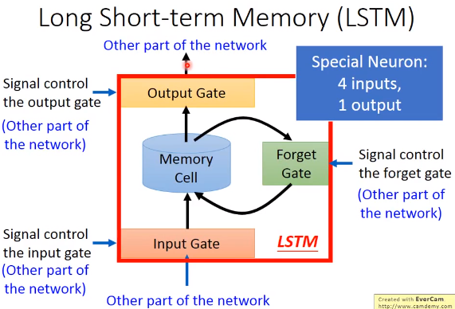

    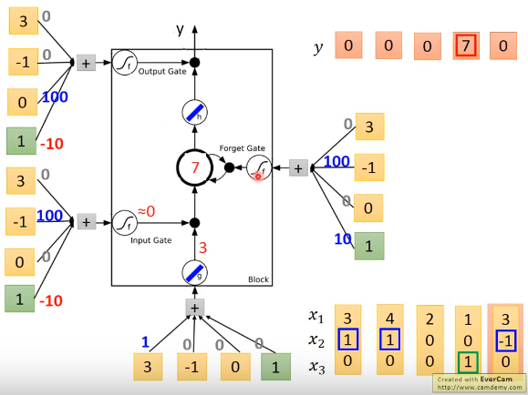

  - #### 那么到底要机器学习的是什么参数？

    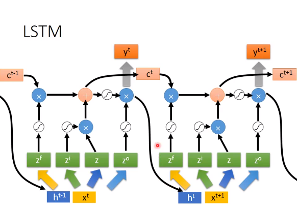
  
    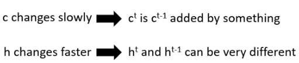

    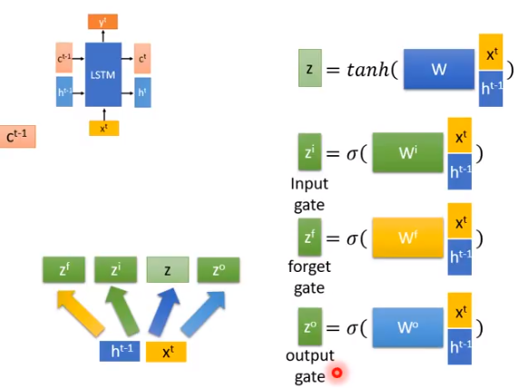

    1.  h^t^ = STM~t~(short term memory) t时刻的短时记忆
  2. c^t^ = LTM~t~(long term memory) t时刻的长时记忆，**为什么它长记忆？因为它只经过了常数乘法（forget gate基本接近1），然后常数加法，所以每次都不会由太大的变化**
    3. Z代表4个不同的矩阵运算W^f^, W^i^, W, W^o^，分别决定了forget gate(0,1), input gate(0,1), input(vector), output gate(0,1)，所以要学习的就是这些个矩阵，当然还有bias也要学习
  4.  需要注意的是，y^t^ 是 h^t^ 乘上一个**矩阵**进行线性变换的得到的向量，因为进行了变换，所以y向量的长度是可以任意的
  
- #### LSTM的反向转播更新方法（BPTT）
  
  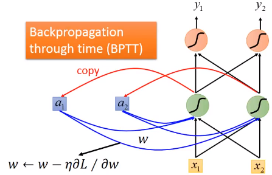
  
- #### RNN的训练
  
  - simpleRNN的劣势
  
    simpleRNN的损失平面可能非常平或者非常陡峭
  
    所以训练的时候经常会导致loss剧烈波动
  
    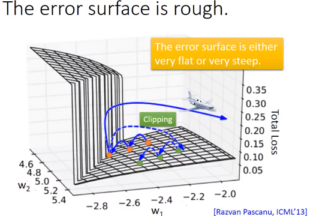
  
    
  
    为什么损失平面非常陡峭？
  
    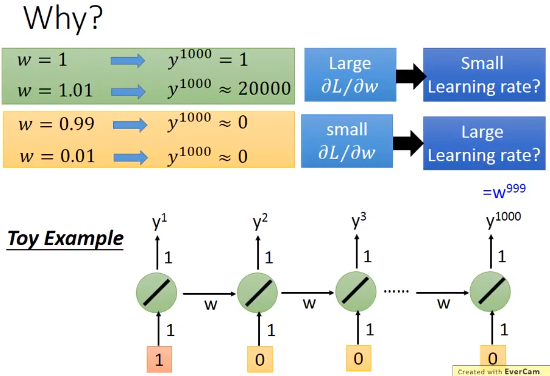
  
    回顾一下simpleRNN，input和memory是相乘然后经过tanh激活的
  
    损失平面非常陡峭的原因是因为hidden的unit的weight在1附近时候的微小变化都会导致后面的y的剧烈变化，这时候需要小一点的学习率，但是weight在0附近的时候的微小变化却又导致后面的y的值变化的很小（梯度消失）导致train很慢，这时候又需要大一点的学习率
  
  - LSTM解决了simpleRNN的梯度消失问题
  
    因为memory会乘上一个值然后在加上input，也就是ltm的计算特点是，只要前面t出现的特征，后面所有的t都会被影响到（早期的lstm没有forget gate），而不是像simplernn一样每次都会经过tanh进行缩小，从而解决了simplernn的梯度消失问题
  
  - LSTM简化版GRU(Gated Recurrent Unit)
  
    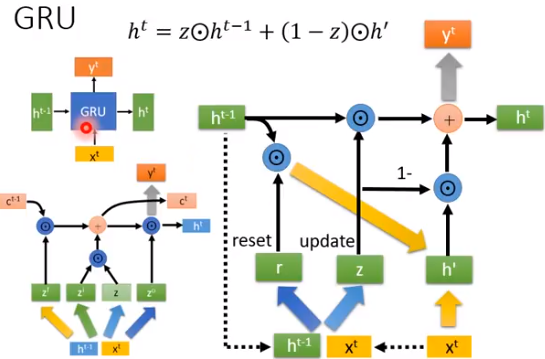
      
    input gate 和 forget gate 会进行联动变成reset gate 只有旧的记忆被完全洗掉（forget date=0）新的输入才可以进来（input gate=1）也就是说forget gate + input gate = 1
  
- LSTM做到的更复杂的结构
  
  - many 2 one
  
    输入seq但是output 是一个vec
  
  - many 2 many
  
    输入seq输出seq
  
    - beyond seq
  
      文字属性分析
  
      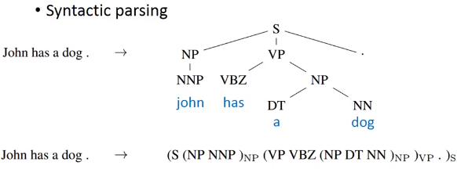
  
    - seq 2 seq  auto-encoder
  
      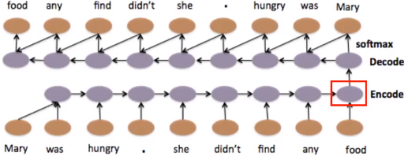