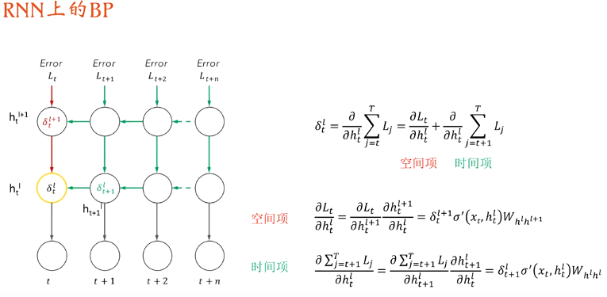

# RNN循环神经网络

- ### 循环神经网络

  - 原理
  - 结构

- #### RNN的专属BP算法：

  ###### BPTT(Back propergate through time)

  

- RNN的代码实现

  - 单隐藏层纯结构版本

    ~~~python
    class RNN(nn.Module):
        def __init__(self,input_size,hidden_size,output_size)：
            super(RNN,self).__init__()
            self.hidden_size = hidden_size
            # 一个embedding层
            self.embed = nn.Embedding(input_size,hidden_size)
            # 隐含层内相互连接,因为它需要输入上一层值和自身一层值
            self.i2h = nn.Linear(2*hidden_size,hidden_size)
            # 隐含层到输出层的连接
            self.h2o = nn.Linear(hidden_size,hidden_size)
            # 最后一层softmax
            self.softmax = nn.LogSoftmax()
            
        def forward(self,input,hidden):
            # 先进行embedding层的计算
            x = self.embed(input)
            # 将输入和隐含层的输出耦合在一起（拼成一个长向量）
            combined = torch.cat((x,hidden),1)
            # 把这个长向量喂给隐含层
            hidden = self.i2h(combined)
            # 从隐含层到输出层的运算
            output = self.h2o(hidden)
            # 最后经过softmax激活
            output = self.softmax(output)
            return output, hidden
        
        def initHidden(self):
            # 对隐含单元的初始化
            # 注意尺寸是：batch_size, hidden_size
            return Variable(torch.zero(1,self.hidden_size))
            
        
        
    ~~~

  - 多隐藏层并调用nn封装版本

    ~~~python
    class my_RNN(nn.Module):
        def __init__(self,input_size,hidden_size,output_size,num_layers = 1):
            # 定义
            super(my_RNN,self).__init__()
            self.hidden_size = hidden_size
            self.num_layers = num_layers
            # 一个embedding层
            self.embedding = nn.Embedding(input_size,hidden_size)
            # pytorch的RNN层，注意它接受的是三维张量
            self.rnn = nn.RNN(hidden_size,hidden_size,num_layers,batch_first=True)
            # 输出全连接层
            self.fc = nn.Linear(hidden_size,output_size)
            # 最后的logsoftmax层
            self.softmax = nn.LogSoftmax()
        
        def forward(self,input,hidden):
            # 运算过程
            # 先进行嵌入，把数值转化为onehot向量，再把这个向量转化为嵌入向量
            x = self.embedding(input)
            # 从输入层到隐含层的计算
            # 注意x的尺寸为batch_size,len_of_seq,hidden_size
            output, hidden = self.rnn(x,hidden)
            # 从output中取出最后一个时间步的数值（因为output中包含了所有的时间步的结果）
            output = output[:,-1,:]
            # 此时得到的output层尺寸为二维：batch_size,hidden_size
            # 最后再接全连接层
            output = self.fc(output)
            # 最后再接一层softmax
            output = self.softmax(output)
            
            return output,hidden
    ~~~

    