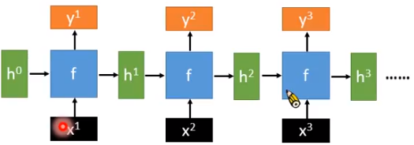
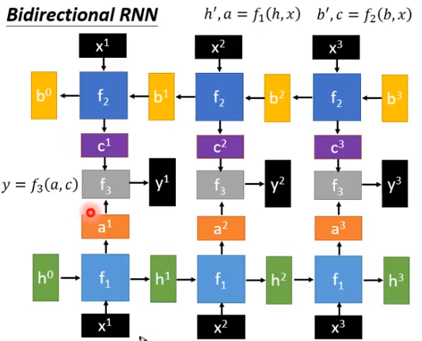
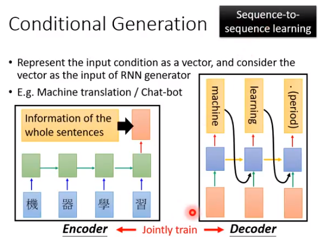
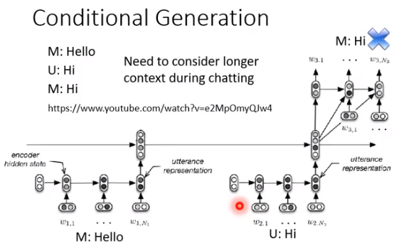
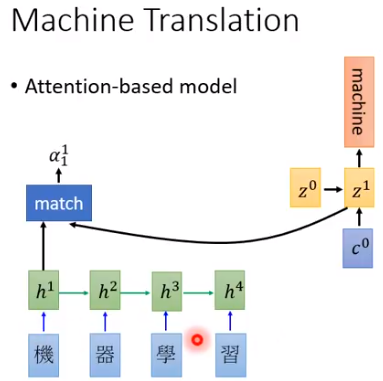
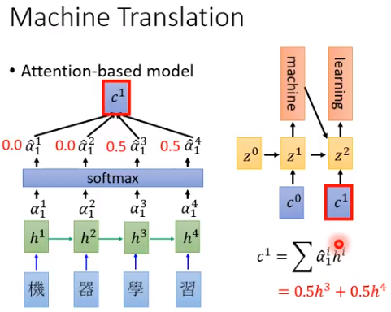

# Seq 2 Seq

- #### 回顾RNN

  是一个这样的函数 h', y =  f ( h, x ) 

  

  - Deep RNN

    

  - Bi - RNN

    

    

- ## Seq 2 Seq

  - #### generation 随机生成

    \<BOS> 代表句首，\<EOS>代表句尾

  - #### Conditional Generation 特定场景生成

    例如chatbox，image caption generation，machine translation

  - #### seq 2 seq learning (encoder &  decoder ）

    

    #### encoder

    注意encoder这个红色的vector是最后一个time step输出的y，也就是说，前面的time step的结果全部都没有用上，这是因为最后一个y因为由记忆，其实已经包含了`机器学习`这4个x生成的vector所包含的信息了

    #### decoder

    然后decoder这个红色的vector其实从始至终都是同一个从encoder中的来的y vector，所以这样就可以连载一起同时进行训练了

    ##### 人机对话的记忆问题

    以上是一个翻译任务，但是如果是一个人机对话任务的话，需要机器decoder要记得自己说过的话，于是有这样的一个做法，假设encoder都是接受人说的话，decoder输出都是机器说的话，那么decoder需要记住自己和人类曾经进行过什么对话（比如说机器已经说过了hi就不要在人回hello的时候机器再回hello）

    所以这时候上图的decoder中的红色的输入就不再是简单的同一个vector而是之前人和机器说过的所有的话，每句话都经过encoder变成一个包含所有seq信息的红色的vector最后再喂给当前的这个decoder

    

     

    #### Attention-base model

    seq 2 seq 结合 attention

    encoder与decoder的交互可以变得更复杂，不只是用一个红色的y vec

    

    也就是说，decoder中的每个输入不会简单的拿encoder的最后一个输出h^4^ 得到的y vector 而是通过match/attention进行“聚焦”，拿到一个分数（标量）

    

    对于decoder的每个输入step来说：把encoder所有step的输出h都计算一个分数（标量），分数越高，那么decoder的这一步step就会越关注这个encoder的输出h，最终把所有的h和各自所得的分数a hat 进行加权求和得到这C 作为这一步的输入，直到产生了\<EOS> 也就是句尾

    注意Z是学出来的，而c^0^ 和 z^0^ 是随机初始化出来的